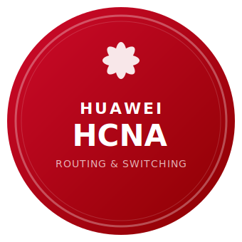

  <strong>Senior DevOps Engineer specializing in Cloud & Kubernetes</strong>

  
  
  
  

---

My journey started when I was just a curious 12-year-old kid, begging my mom to buy me the book _"Hacking Exposed 4: Network Security Secrets & Solutions"_ published by McGraw Hill. I still get chills thinking about it!

Honestly though, after reading it, I realized I'd prefer building things rather than breaking them. Fast forward over two decades, and here I am — fully embracing life in the cloud, building and scaling apps, and loving every second of it.

#### Latest Posts

<!-- BLOG-POST-LIST:START -->
- [On Overengineering &lpar;DevOps Edition&rpar;](https://geiser.cloud/on-overengineering-devops-edition/)
- [Deploying Garage S3 &lpar;v2.x&rpar; and Hooking It Up to Duplicacy](https://geiser.cloud/deploying-garage-s3-v2-x-and-hooking-it-up-to-duplicacy/)
- [Putting AI-Hands on Routers: Building a GenieACS MCP Server in Go](https://geiser.cloud/putting-ai-hands-on-routers-building-a-genieacs-mcp-server-in-go/)
- [Paging into the Night—Assess Before You Fix: Many Years of On-Call Lessons](https://geiser.cloud/paging-into-the-night-assess-before-you-fix-many-years-of-on-call-lessons/)
- [DevOps in the Catacombs – Everyday Software Archaeology and Why I’d Still Bet on a Monorepo](https://geiser.cloud/software-archaeology-monorepo/)
<!-- BLOG-POST-LIST:END -->

## Certifications

  &nbsp;&nbsp;
  &nbsp;&nbsp;
  &nbsp;&nbsp;
  &nbsp;&nbsp;
  &nbsp;&nbsp;
  &nbsp;&nbsp;
  

## Projects

 

 

 

 

 

 

 

 

 

 

 

 

 

 

 

 

 

 

