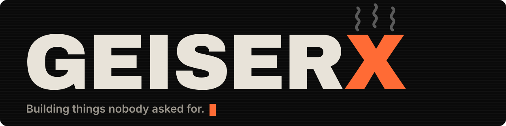
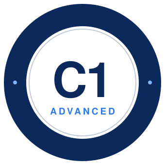
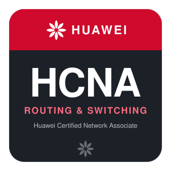

  

  <strong>Staff AI Engineer with a pre-AI-era background on Cloud, Distributed Computing, Networking and Software Engineering</strong>
   
  <i>Building things nobody asked for, one repo at a time.</i>

  
  
  
  

---

My journey started when I was just a curious 12-year-old kid, begging my mom to buy me the book _"Hacking Exposed 4: Network Security Secrets & Solutions"_ published by McGraw Hill. I still get chills thinking about it!

Honestly though, after reading it, I realized I'd prefer building things rather than breaking them. Fast forward over two decades, and here I am, fully embracing life in the cloud, building and scaling apps, and loving every second of it.

## Latest posts

<!-- BLOG-POST-LIST:START -->
- [Why I built akou, one app for my calls and my dictation](https://geiser.cloud/why-i-built-akou/)
- [Overengineering in DevOps, and the network project that could have been an email](https://geiser.cloud/on-overengineering-devops-edition/)
- [What disaster recovery needs when the region dies](https://geiser.cloud/the-day-the-region-died-lessons-in-disaster-recovery/)
- [Deploying a three-node Garage S3 cluster and hooking it up to Duplicacy](https://geiser.cloud/deploying-garage-s3-v2-x-and-hooking-it-up-to-duplicacy/)
- [Building a GenieACS MCP server in Go so an LLM can manage routers](https://geiser.cloud/putting-ai-hands-on-routers-building-a-genieacs-mcp-server-in-go/)
<!-- BLOG-POST-LIST:END -->

## Certifications

  &nbsp;&nbsp;
  &nbsp;&nbsp;
  &nbsp;&nbsp;
  
   
  &nbsp;&nbsp;
  &nbsp;&nbsp;
  

## Projects

 

 

 

 

 

 

 

 

 

 

 

 

 

 

 

 

